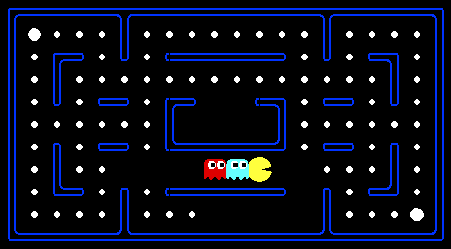

# Assignment 1 for csc384 in University of Toronto

This assignment is based on *UC Berkely Pacman AI project*.

In [search.py](./search.py), we implemented uniform cost, BFS, DFS, and A* search algorithm.

In [searchAgents.py](./searchAgents.py), we defined a few problems we need to solve, such as Corners Problem(reaching all four corners on the game board), and Food Search Problem(eating all the food on the game board).

+ `python pacman.py` to run the game
+ `python autograder.py` to run all the testsT
+ `python autograder.py -q q2` to run particular question
+ `python autograder.py -t test_cases/q2/0-small-tree` to run particular test case
+ By default, the autograder displays graphics with the `-t` option, but doesn't with the `-q` option. You can force graphics by using the `--graphics` flag, or force no graphics by using the `--no-graphics` flag.
